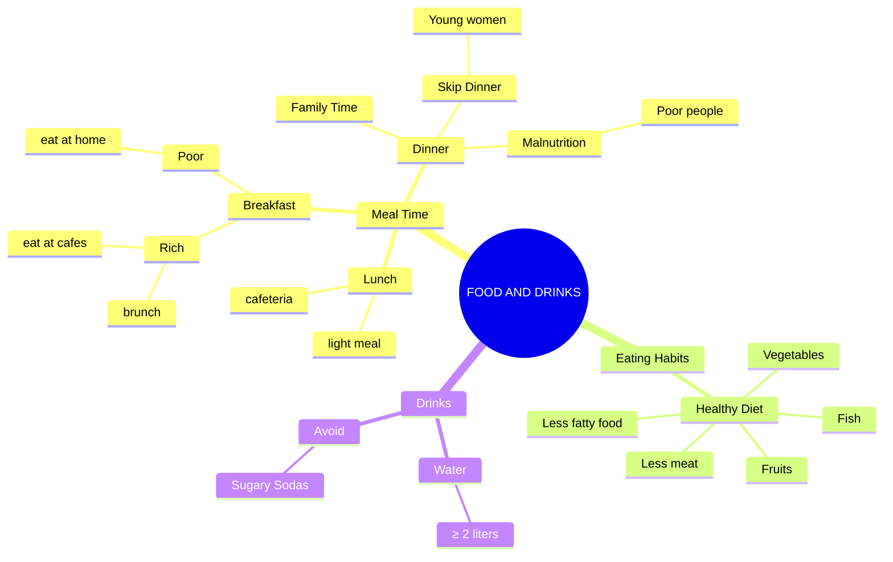

FOOD AND DRINK

Luyện tập hoàn chỉnh cho bài hội thoại “Talking About Food and Eating Habits in Vietnam” — rất phù hợp để sử dụng trong lớp học hoặc tự luyện tập. Gồm có:

⸻

📚 1. Vocabulary Practice – Từ vựng cần nhớ

Từ vựng	Nghĩa tiếng Việt
brunch	bữa sáng trễ kết hợp bữa trưa
late-night snack	bữa ăn khuya
suffer from malnutrition	bị suy dinh dưỡng
healthy diet	chế độ ăn lành mạnh
vegetables (veggies)	rau củ
gain weight	tăng cân
stay slim	giữ dáng
sugary drinks/sodas	nước ngọt có đường
natural juice	nước ép trái cây tự nhiên
cafeteria/canteen	nhà ăn, căn-tin
Westerner: a person who comes from a country in the western part of the world, especially North America or western Europe

⸻

❓ 2. Comprehension Questions – Câu hỏi hiểu bài

WH-Questions:
	1.	What are the three main meals of the day in Vietnam?
	2.	When do night workers usually eat breakfast?
	3.	What do Vietnamese people usually eat to stay healthy?
	4.	Where do rich people often have breakfast?
	5.	Why do young women avoid eating dinner?

Yes/No Questions:
	1.	Do Vietnamese people eat a lot of meat?
	2.	Do factory workers usually go home for lunch?
	3.	Is dinner a time for family to be together?
	4.	Should we drink sugary sodas every day?
	5.	Can poor people always afford enough food?

Tag Questions:
	1.	Brunch is a mix of breakfast and lunch, isn’t it?
	2.	Vietnamese food is healthier than Western food, isn’t it?
	3.	Rich people usually eat out, don’t they?
	4.	Some people suffer from malnutrition, don’t they?
	5.	Water is better for you than soda, isn’t it?

⸻

🗣️ 3. Role-play Activity – Hoạt động đóng vai

A: You are a student who eats at home.
B: You are a singer who often eats late and goes out a lot.

➡️ Talk about:
	•	Your daily meal schedule
	•	What you usually eat
	•	Why you eat that way
	•	What you think about skipping dinner
	•	Your thoughts on healthy drinks

📝 Teacher’s Tip: Switch roles and ask students to compare their lifestyles with each other. Encourage them to use the questions above in the conversation.

⸻

✅ 4. Optional Writing Prompt – Viết đoạn văn ngắn

Topic: Describe your eating habits and explain whether you think they are healthy or not. What changes would you like to make?

⸻

