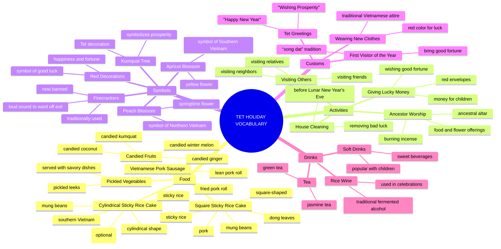

```mermaid
mindmap
  root((TET HOLIDAY VOCABULARY))
    Food
      Square Sticky Rice Cake 
        sticky rice
        square-shaped
        pork
        mung beans
        dong leaves
      Cylindrical Sticky Rice Cake 
        cylindrical shape
        sticky rice
        mung beans
        banana (optional)
        southern Vietnam
      Pickled Vegetables
        pickled leeks 
        served with savory dishes
      Vietnamese Pork Sausage 
        lean pork roll 
        fried pork roll 
      Candied Fruits 
        candied coconut
        candied ginger
        candied kumquat
        candied winter melon
    Activities
      House Cleaning
        removing bad luck
        before Lunar New Year's Eve
      Ancestor Worship
        ancestral altar
        burning incense
        food and flower offerings
      Visiting Others
        visiting relatives
        visiting neighbors
        visiting friends
      Giving Lucky Money
        red envelopes
        money for children
        wishing good fortune
    Symbols
      Peach Blossom
        symbol of Northern Vietnam
        springtime flower
      Apricot Blossom
        symbol of Southern Vietnam
        yellow flower
      Kumquat Tree
        symbolizes prosperity
        Tet decoration
      Red Decorations
        symbol of good luck
        happiness and fortune
      Firecrackers
        traditionally used
        loud sound to ward off evil
        now banned
    Customs
      First Visitor of the Year
        “xong dat” tradition
        bring good fortune
      Wearing New Clothes
        red color for luck
        traditional Vietnamese attire
      Tet Greetings
        "Happy New Year" 
        "Wishing Prosperity" 
    Drinks
      Tea
        green tea
        jasmine tea
      Rice Wine
        traditional fermented alcohol
        used in celebrations
      Soft Drinks
        sweet beverages
        popular with children
```