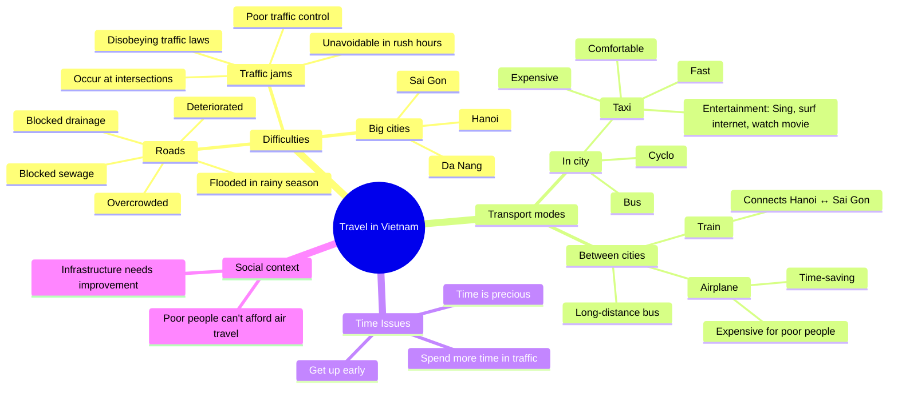

```mermaid
mindmap
  root((Travel in Vietnam))

    Difficulties
      Big cities
        Hanoi
        Da Nang
        Sai Gon
      Roads
        Overcrowded
        Deteriorated
        Flooded in rainy season
        Blocked drainage
        Blocked sewage
      Traffic jams
        Occur at intersections
        Unavoidable in rush hours
        Poor traffic control
        Disobeying traffic laws

    Transport modes
      In city
        Bus
        Taxi
          Expensive
          Comfortable
          Fast
          Entertainment: Sing, surf internet, watch movie
        Cyclo
      Between cities
        Long-distance bus
        Train
          Connects Hanoi ↔ Sai Gon
        Airplane
          Time-saving
          Expensive for poor people

    Time Issues
      Get up early
      Spend more time in traffic
      Time is precious

    Social context
      Poor people can't afford air travel
      Infrastructure needs improvement
```