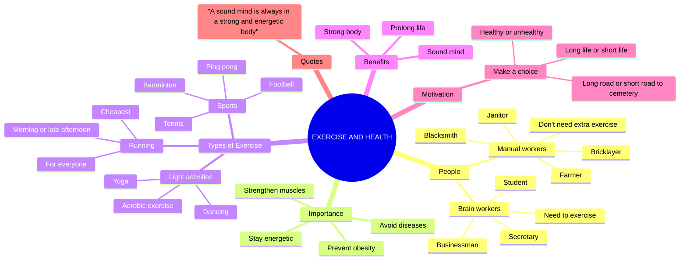

```mermaid
mindmap
  root((EXERCISE AND HEALTH))
    People
      Manual workers
        Farmer
        Blacksmith
        Janitor
        Bricklayer
        Don't need extra exercise
      Brain workers
        Student
        Secretary
        Businessman
        Need to exercise
    Importance
      Strengthen muscles
      Prevent obesity
      Avoid diseases
      Stay energetic
    Types of Exercise
      Sports
        Tennis
        Ping pong
        Badminton
        Football
      Light activities
        Dancing
        Yoga
        Aerobic exercise
      Running
        Cheapest
        For everyone
        Morning or late afternoon
    Benefits
      Sound mind
      Strong body
      Prolong life
    Motivation
      Make a choice
        Healthy or unhealthy
        Long life or short life
        Long road or short road to cemetery
    Quotes
      "A sound mind is always in a strong and energetic body"
```