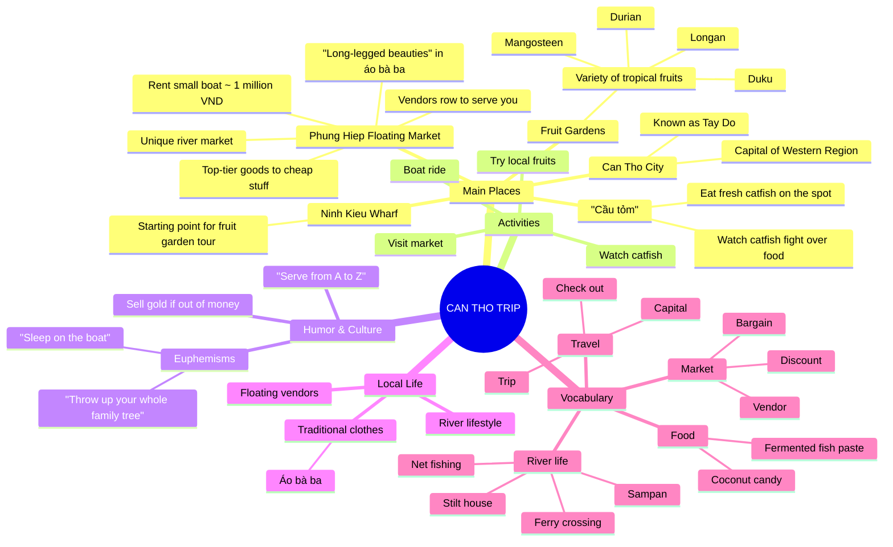

```mermaid
mindmap
  root((CAN THO TRIP))
    Main Places
      Can Tho City
        Capital of Western Region
        Known as Tay Do
      Phung Hiep Floating Market
        Unique river market
        Rent small boat ~ 1 million VND
        Top-tier goods to cheap stuff
        Vendors row to serve you
        "Long-legged beauties" in áo bà ba
      Ninh Kieu Wharf
        Starting point for fruit garden tour
      Fruit Gardens
        Variety of tropical fruits
          Duku
          Durian
          Mangosteen
          Longan
      "Cầu tỏm"
        Watch catfish fight over food
        Eat fresh catfish on the spot
    Activities
      Boat ride
      Visit market
      Try local fruits
      Watch catfish
    Humor & Culture
      Sell gold if out of money
      "Serve from A to Z"
      Euphemisms
        "Sleep on the boat"
        "Throw up your whole family tree"
    Local Life
      River lifestyle
      Floating vendors
      Traditional clothes
        Áo bà ba
    Vocabulary
      Travel
        Check out
        Trip
        Capital
      Food
        Coconut candy
        Fermented fish paste
      River life
        Sampan
        Stilt house
        Net fishing
        Ferry crossing
      Market
        Vendor
        Bargain
        Discount
```