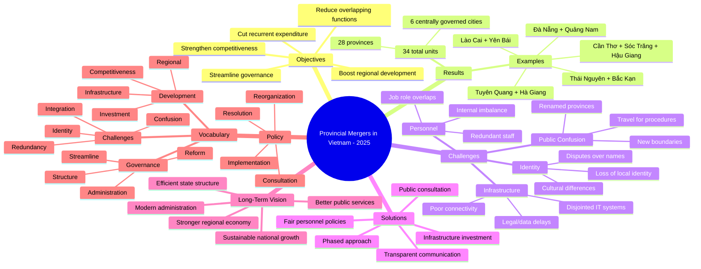

```mermaid
mindmap
  root((Provincial Mergers in Vietnam - 2025))
    Objectives
      Streamline governance
      Reduce overlapping functions
      Cut recurrent expenditure
      Boost regional development
      Strengthen competitiveness
    Results
      34 total units
        28 provinces
        6 centrally governed cities
      Examples
        Tuyên Quang + Hà Giang
        Lào Cai + Yên Bái
        Thái Nguyên + Bắc Kạn
        Đà Nẵng + Quảng Nam
        Cần Thơ + Sóc Trăng + Hậu Giang
    Challenges
      Public Confusion
        New boundaries
        Renamed provinces
        Travel for procedures
      Personnel
        Redundant staff
        Internal imbalance
        Job role overlaps
      Identity
        Cultural differences
        Loss of local identity
        Disputes over names
      Infrastructure
        Poor connectivity
        Disjointed IT systems
        Legal/data delays
    Solutions
      Phased approach
      Transparent communication
      Fair personnel policies
      Infrastructure investment
      Public consultation
    Long-Term Vision
      Modern administration
      Efficient state structure
      Stronger regional economy
      Better public services
      Sustainable national growth
    Vocabulary
      Governance
        Administration
        Reform
        Streamline
        Structure
      Development
        Regional
        Competitiveness
        Infrastructure
        Investment
      Challenges
        Confusion
        Redundancy
        Integration
        Identity
      Policy
        Resolution
        Consultation
        Implementation
        Reorganization

```