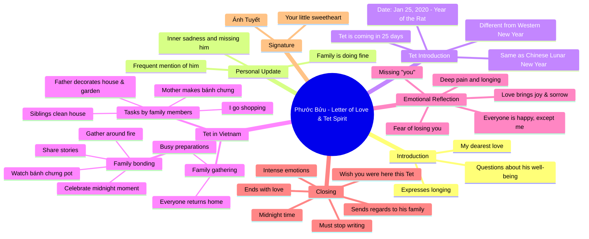

```mermaid
mindmap
  root((Phước Bửu - Letter of Love & Tet Spirit))
  
    Introduction
      My dearest love
      Questions about his well-being
      Expresses longing

    Personal Update
      Family is doing fine
      Frequent mention of him
      Inner sadness and missing him

    Tet Introduction
      Tet is coming in 25 days
      Different from Western New Year
      Same as Chinese Lunar New Year
      Date: Jan 25, 2020 - Year of the Rat

    Tet in Vietnam
      Family gathering
        Busy preparations
        Everyone returns home
      Tasks by family members
        Father decorates house & garden
        Mother makes bánh chưng
        I go shopping
        Siblings clean house
      Family bonding
        Gather around fire
        Share stories
        Watch bánh chưng pot
        Celebrate midnight moment

    Emotional Reflection
      Everyone is happy, except me
      Deep pain and longing
      Missing "you"
      Love brings joy & sorrow
      Fear of losing you

    Closing
      Wish you were here this Tet
      Intense emotions
      Must stop writing
      Midnight time
      Sends regards to his family
      Ends with love
      
    Signature
      Your little sweetheart
      Ánh Tuyết
```