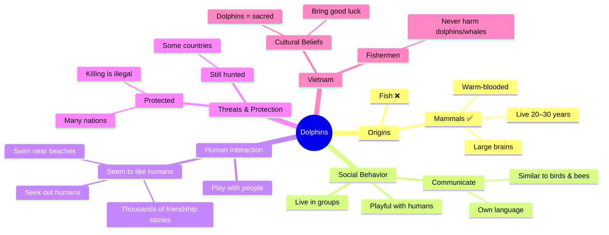

```mermaid
mindmap
  root((Dolphins))

    Origins
      Fish ❌
      Mammals ✅
        Warm-blooded
        Large brains
        Live 20–30 years

    Social Behavior
      Live in groups
      Communicate
        Own language
        Similar to birds & bees
      Playful with humans

    Human Interaction
      Seem to like humans
        Thousands of friendship stories
        Swim near beaches
        Seek out humans
      Play with people

    Threats & Protection
      Still hunted
        Some countries
      Protected
        Many nations
        Killing is illegal

    Vietnam
      Cultural Beliefs
        Dolphins = sacred
        Bring good luck
      Fishermen
        Never harm dolphins/whales
```