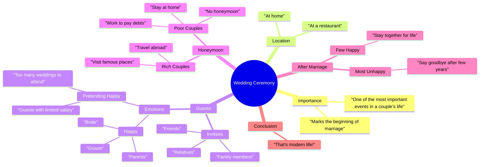

```mermaid
mindmap
  root((Wedding Ceremony))
    Importance
      "One of the most important events in a couple’s life"
      "Marks the beginning of marriage"
    Location
      "At home"
      "At a restaurant"
    Guests
      Invitees
        "Relatives"
        "Family members"
        "Friends"
      Emotions
        Happy
          "Bride"
          "Groom"
          "Parents"
        Pretending Happy
          "Guests with limited salary"
          "Too many weddings to attend"
    Honeymoon
      Rich Couples
        "Travel abroad"
        "Visit famous places"
      Poor Couples
        "Stay at home"
        "No honeymoon"
        "Work to pay debts"
    After Marriage
      Few Happy
        "Stay together for life"
      Most Unhappy
        "Say goodbye after few years"
    Conclusion
      "That's modern life!"
```