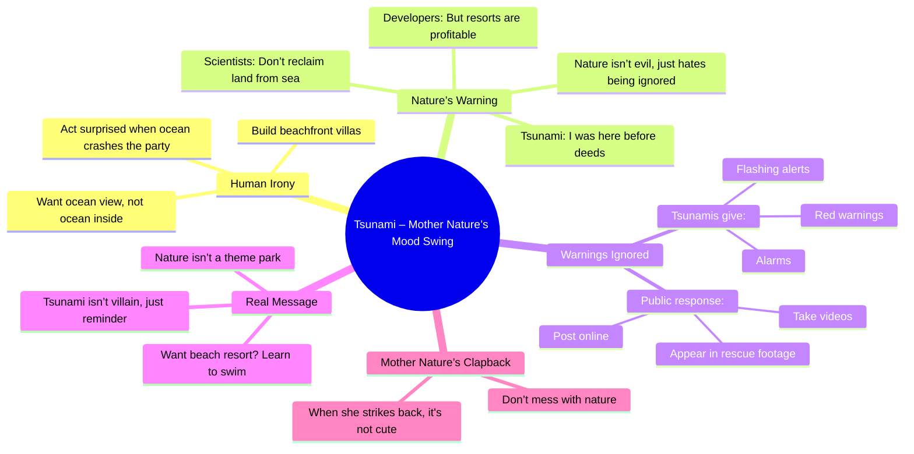

```mermaid
mindmap
  root((Tsunami – Mother Nature’s Mood Swing))

    Human Irony
      Build beachfront villas
      Want ocean view, not ocean inside
      Act surprised when ocean crashes the party

    Nature’s Warning
      Nature isn’t evil, just hates being ignored
      Scientists: Don’t reclaim land from sea
      Developers: But resorts are profitable
      Tsunami: I was here before deeds

    Warnings Ignored
      Tsunamis give:
        Alarms
        Flashing alerts
        Red warnings
      Public response:
        Take videos
        Post online
        Appear in rescue footage

    Real Message
      Nature isn’t a theme park
      Tsunami isn’t villain, just reminder
      Want beach resort? Learn to swim

    Mother Nature’s Clapback
      Don’t mess with nature
      When she strikes back, it's not cute
```