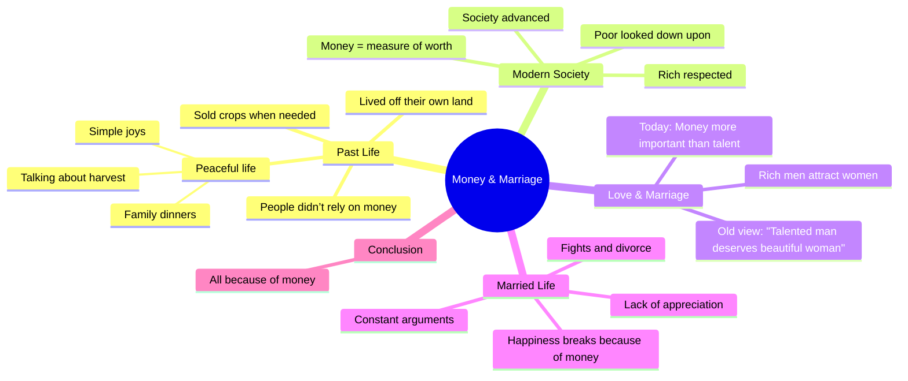

```mermaid
mindmap
  root((Money & Marriage))

    Past Life
      People didn’t rely on money
      Lived off their own land
      Sold crops when needed
      Peaceful life
        Family dinners
        Talking about harvest
        Simple joys

    Modern Society
      Society advanced
      Money = measure of worth
      Rich respected
      Poor looked down upon

    Love & Marriage
      Rich men attract women
      Old view: "Talented man deserves beautiful woman"
      Today: Money more important than talent

    Married Life
      Happiness breaks because of money
      Lack of appreciation
      Constant arguments
      Fights and divorce

    Conclusion
      All because of money

```
