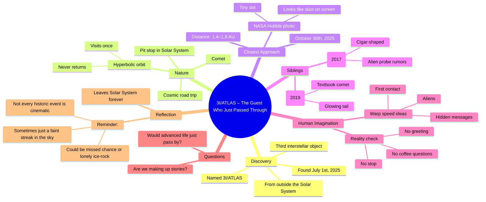

```mermaid
mindmap
  root((3I/ATLAS – The Guest Who Just Passed Through))

    Discovery
      Found July 1st, 2025
      Third interstellar object
      Named 3I/ATLAS
      From outside the Solar System

    Nature
      Comet
      Hyperbolic orbit
        Visits once
        Never returns
      Cosmic road trip
      Pit stop in Solar System

    Closest Approach
      October 30th, 2025
      Distance: 1.4–1.8 AU
      NASA Hubble photo
        Tiny dot
        Looks like dust on screen

    Siblings
      1I/ʻOumuamua (2017)
        Cigar-shaped
        Alien probe rumors
      2I/Borisov (2019)
        Textbook comet
        Glowing tail

    Human Imagination
      Warp speed ideas
        Aliens
        Hidden messages
        First contact
      Reality check
        No stop
        No greeting
        No coffee questions

    Questions
      Would advanced life just pass by?
      Are we making up stories?

    Reflection
      Leaves Solar System forever
      Reminder:
        Not every historic event is cinematic
        Sometimes just a faint streak in the sky
        Could be missed chance or lonely ice-rock

```