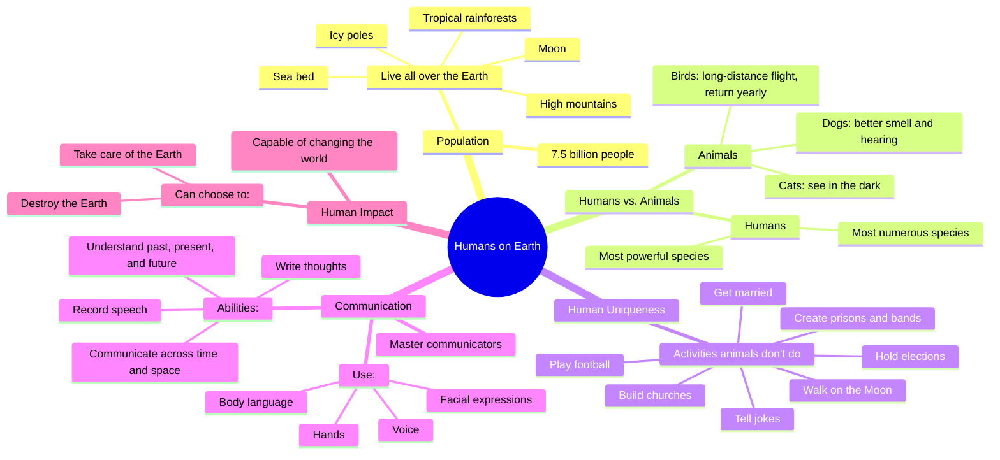

```mermaid
mindmap
  root((Humans on Earth))

    Population
      7.5 billion people
      Live all over the Earth
        Icy poles
        Tropical rainforests
        High mountains
        Sea bed
        Moon

    Humans vs. Animals
      Humans
        Most numerous species
        Most powerful species
      Animals
        Dogs: better smell and hearing
        Cats: see in the dark
        Birds: long-distance flight, return yearly

    Human Uniqueness
      Activities animals don't do
        Build churches
        Play football
        Tell jokes
        Get married
        Create prisons and bands
        Hold elections
        Walk on the Moon

    Communication
      Master communicators
      Use:
        Facial expressions
        Hands
        Body language
        Voice
      Abilities:
        Record speech
        Write thoughts
        Communicate across time and space
        Understand past, present, and future

    Human Impact
      Capable of changing the world
      Can choose to:
        Take care of the Earth
        Destroy the Earth
```